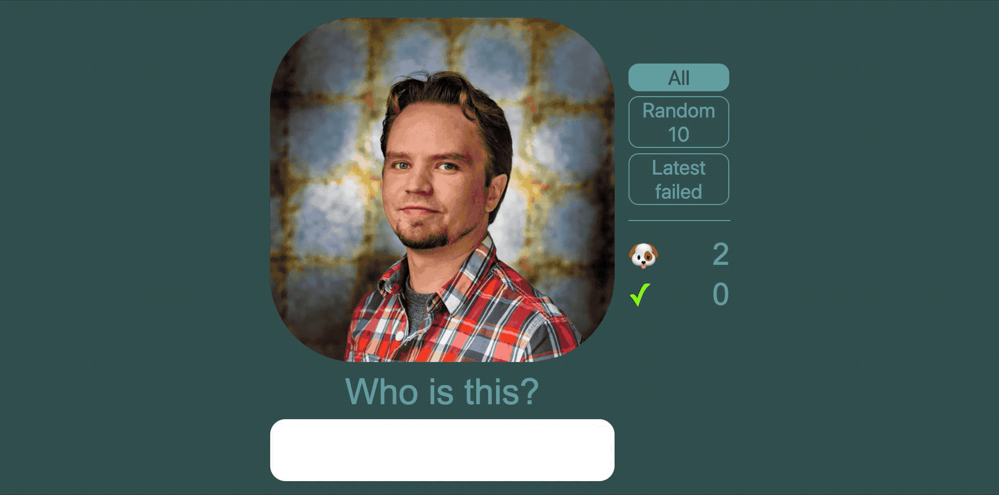

# Slack Gallery Quiz

A gamified tool to help one learn to know - or at least recognize - one's colleagues or other Slack team members.



## Prerequisites

- The quiz uses **Google** authentication to limit access to users with a certain organizational email address only. You can use other authentication providers if you like but currently the code supports Google only. (As do these instructions.) 

- You need a **Firebase** project for hosting your service.

  1. Go to https://console.firebase.google.com/ and select "Add project". Fill in the required values.

  1. After the project is created, select "Authentication" from the menu, then select "Google" from the list, and enable it. (If Firebase asks you to update some project-level settings, do so.)

- You need a **Slack** app token to be able to fetch the user names and images of a Slack workspace. (_Instructions for creating one isn't in the scope of this readme - at least yet._)

  1. Go to https://[your workspace].slack.com/ and sign in.

  1. Go to https://api.slack.com/apps and select "Create new app". Give your app a name and select the Slack workspace you want it to use, i.e. the one where you want the profiles to be read from.

  1. Under "Add features and functionality", select "Permissions".

  1. Under "Scopes", select "Access your workspace’s profile information (users:read)" **only** and save changes. The app does NOT need any other rights, e.g. to read channel information or send messages. 

  1. Select "Install app to workspace" on the top of the same page and authorize it. (Only available after finishing the previous step.)

## Development

1. Clone the repo.

1. Install the dependencies.
   ```
   yarn run setup
   ```
   
1. Copy/rename the `.env.template` file to `.env` and fill in all the values.
   - For the ones starting with `FIREBASE` you need IDs from your Firebase project. The simplest way to get these is by running:
     ```
     yarn firebase setup:web
     ```
     and copying the values one by one to correct places. 
   - The `GOOGLE_ORGANIZATION` value is used to limit the access to the service to people with a certain email address only. This value is the required domain of the address. 

1. Log in to Firebase using the Firebase client (installed as a development dependency):
   ```
   yarn firebase login
   ```
   This will open a browser window for logging in.

1. Add Firebase project configuration.
   
   ```
   yarn firebase use --add
   ```   

1. Add the Slack token to cloud function configuration:
   ```
   yarn firebase functions:config:set slack.token="<the token you got from Slack when authorizing the app>"
   ```

1. Get a copy of the cloud function configuration for running the service locally:
   ```
   yarn --silent firebase functions:config:get > functions/.runtimeconfig.json
   ```

1. Build and run the app:
   ```
   yarn build
   yarn start
   ```
## Deployment

To deploy the app to Firebase simply run:
```
yarn deploy
```

### Improvement ideas

- Consider offering answer options (e.g. 4 names) instead of requiring the user to enter the name manually.
- Consider adding a leaderboard – or some other stats.
- Add a lazy loading indicator when loading the next image. 